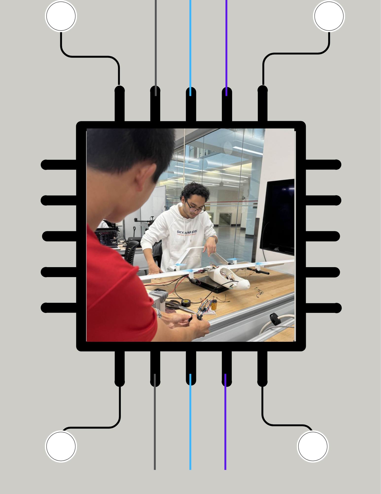
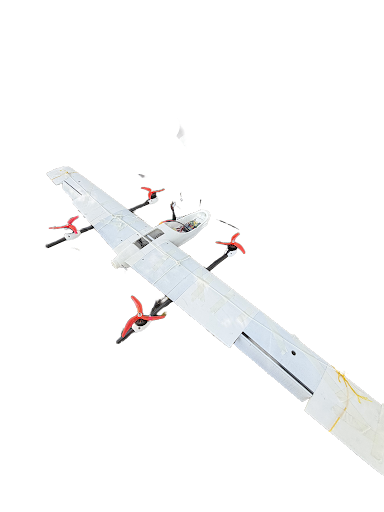
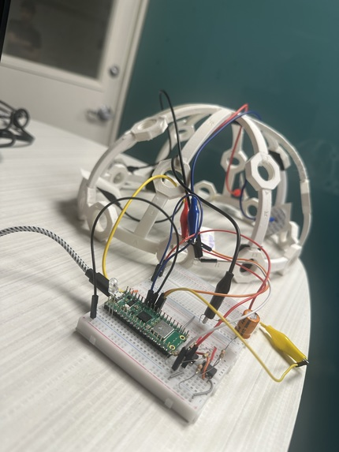
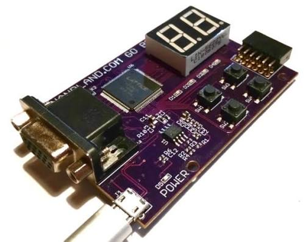

<h1 align="center">Hi, I'm Bek 👾</h1>

  

I'm passionate about building revolutionary intelligent machines that interact and help in the physical world.

  

  

  

  

  

## 📌 Projects
<table align="center">
  <tr>
    <td align="center">
      <a href="https://github.com/BekG123/Sky2-autonomous-drone">
        Sky2 Autonomous Drone
      </a>
        
      
    </td>
    <td align="center">
      <a href="https://github.com/BekG123/brain2bach">
        Music Generation with EEG & AI
      </a>
        
      
    </td>
    <td align="center">
      <a href="https://github.com/BekG123/veri-smart-trades">
        VeriSmart FPGA
      </a>
        
      
    </td>
  </tr>
</table>
